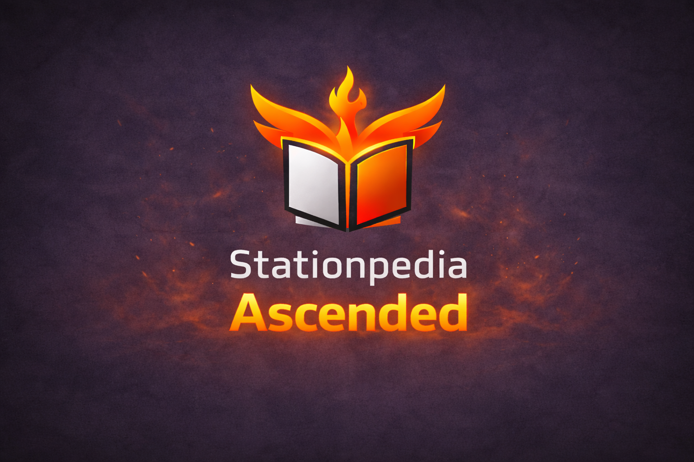

# 🔥 Stationpedia Ascended

**An enhanced Stationpedia experience for Stationeers with comprehensive tooltips, bug fixes, and quality of life improvements.**


*The new Stationpedia Ascended interface with custom phoenix branding*

## ✨ Features

### 🎯 Enhanced Tooltips System
Get detailed explanations for every aspect of your devices with our comprehensive tooltip system:

- **Logic Descriptions** - Hover over logic types to understand their functionality
- **Slot Information** - Detailed explanations of what each slot type does
- **Memory & Registers** - Clear descriptions of memory addresses and their purposes  
- **Device Modes** - Understand different operational modes for devices
- **Connection Types** - Learn about different connection types and their uses


*Comprehensive tooltips provide detailed information on hover*

### 🔍 Vastly Improved Search Functionality
- **Exact Match Prioritization** - Puts the word "Corn" up first if you type it
- **Categorical Search** - Sorts by categories now
- **Removed Wreckage/Ruptured/Burnt items** - Stuff that the devs forgot to hide in Stationpedia is now hidden


### 🔧 Operational Details Section
A dedicated section for device-specific operational details and advanced functionality:

- Appears at the top of device pages for immediate visibility
- Phoenix icon displayed next to the category title
- Configurable title color via JSON
- Collapsible by default to maintain clean interface
- Fully customizable via JSON configuration
- Explains unique device behaviors not covered in standard descriptions


*Operational Details section provides advanced device information*

### 📝 Page Description Customization
Complete control over Stationpedia page descriptions:

- **Replace** existing descriptions entirely
- **Append** additional information after existing content
- **Prepend** important notes before existing descriptions
- JSON-based configuration for easy management


### 🐛 Stationpedia Bug Fixes

#### Scrollbar Handle Fix
Resolves the frustrating scrollbar handle disappearance bug that affects the base game:
- Handles now remain visible on all Stationpedia pages
- Fixes position corruption that caused handles to vanish
- Implements robust 5-frame correction system


*Before and after: Scrollbar handles now work correctly on all pages*

#### Window Dragging Fix  
Eliminates crashes when dragging the Stationpedia window in the main menu:
- No more null reference exceptions
- Smooth dragging experience in all game states
- Maintains window bounds and positioning

### 🎨 Custom Branding
- **Phoenix Logo** - Custom phoenix icon replaces the original book icon
- **"Stationpedia Ascended"** branding in the window header
- **Orange Accent Colors** - Consistent theming throughout the interface
- Maintains compatibility with existing UI elements


*Custom phoenix logo and Stationpedia Ascended branding*

## Installation

### Method 1: Via StationeersLaunchPad (Recommended)

1. Install [StationeersLaunchPad](https://github.com/StationeersLaunchPad/StationeersLaunchPad/releases) (follow the instructions on that GitHub to install Bepinex etc.)
2. Go to Steam Workshop and subscribe to Stationpedia Ascended 
3. Start the game and make sure you see the StationeersLaunchPad black window during load
4. If you hit f1 you should see Stationpedia Ascended & our logo at the top of your Stationpedia!


## ⚙️ Configuration

### descriptions.json
The mod uses a JSON configuration file for all customizations:

```json
{
  "genericDescriptions": {
    "logic": {
      "Power": "Controls device power state - 1 for on, 0 for off",
      "Setting": "Adjusts device operational parameters",
      "Temperature": "Current temperature reading in Kelvin"
    },
    "slots": {
      "Power": "Electrical power connection - provides or consumes electricity",
      "Atmosphere": "Gas input/output for atmospheric processing"
    },
    "memory": {
      "Setting": "Stores device configuration values",
      "Temperature": "Current temperature sensor reading"
    },
    "modes": {
      "0": "Device disabled/off state",
      "1": "Standard operational mode"
    },
    "connections": {
      "Power": "Electrical power delivery system",
      "Data": "Digital communication channel"
    }
  },
  "devices": {
    "ThingAtmospherics": {
      "operationalDetails": [
        {"header": "Pressure Management", "body": "This device can process multiple gas types simultaneously and requires careful pressure management."}
      ],
      "operationalDetailsTitleColor": "#FF7A18",
      "pageDescription": "Complete replacement of the original page description.",
      "pageDescriptionAppend": "Additional information appended to the existing description.",
      "pageDescriptionPrepend": "Important notice added before the existing description."
    }
  }
}
```

### Customization Examples

#### Adding Logic Tooltips
```json
"logic": {
  "CustomValue": "Your explanation here",
  "PowerConsumption": "Amount of power this device uses"
}
```

#### Device-Specific Operational Details
```json
"devices": {
  "YourDevicePageKey": {
    "operationalDetails": [
      {"header": "Special Mechanics", "body": "Explain unique mechanics, tips, or advanced usage patterns"}
    ],
    "operationalDetailsTitleColor": "#FFD700",
    "pageDescriptionAppend": "Additional safety warnings or usage notes"
  }
}
```

## 🤝 Contributing

We welcome contributions! Areas where you can help:

- **Descriptions Database** - Add more comprehensive logic/slot/memory descriptions
- **Device Behaviors** - Document special behaviors for various devices
- **Bug Reports** - Report any issues or conflicts with other mods
- **Feature Requests** - Suggest new functionality or improvements

### Development Setup
1. Clone the repository
2. Install .NET Framework 4.8
3. Reference Stationeers assemblies in project
4. Use hot-reload for rapid testing

## 📋 Requirements

- **Stationeers** (Latest Stable Version)
- **StationeersLaunchPad** (Latest Version)
- **Bepinex** 


## 📞 Support

- **Issues**: [GitHub Issues](https://github.com/FlorpyDorpinator/StationpediaAscended/issues)
- **Discord**: [Stationeers Modding Community](https://discord.com/channels/1370137389837717545/1454566815903514625r)

## 📜 License

This project is licensed under the MIT License - see the [LICENSE](LICENSE) file for details.

## 🙏 Acknowledgments

- **Stationeers Development Team** - For creating an amazing game with extensive modding support
- **BepInEx Team** - For the excellent modding framework
- **Stationeers Modding Community** - For inspiration, feedback, and collaboration. In particular Aproprosmath and JoeDiertay for their incrediblly generous advice, support and help making this.
- **Contributors** - Thank you to everyone who helps improve this mod


*Made with ❤️ for the Stationeers community*

